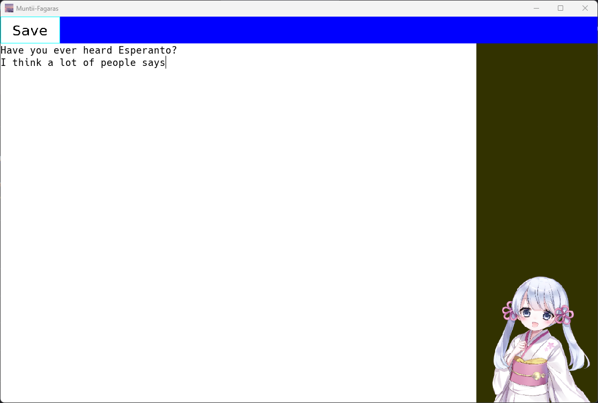

# SDL2によるテキストエディタの開発

---
<!--
_footer: "[つくよみちゃん](https://tyc.rei-yumesaki.net/)を使用 Illustration by えみゃコーラ"
-->
## 開発したもの

テキストエディタを開発した

---

## 開発の背景

- 複数のOSで動作するテキストエディタを開発したい
  - Windows,Linux,ReactOS
- 古いOSでも動作させるようにしたい
  - Windows XPやWindows Server 2003などのNT 5以降
- ユーザーのモチベーションを向上する支援機能を搭載したい

---

## 使用したライブラリ

- それぞれのOSの違いを吸収するライブラリ
  - OSの違いを吸収する必要最低限のみ
  - 同一のソースコードで複数OS向けにビルドできる
- 本体はC言語で記述され、ほかの言語へのバインディングが有志によって開発されている

---

## 本アプリの特徴

- ユーザーのモチベーション維持
  - つくよみちゃんと呼ばれるキャラクターがユーザーを応援する
  - 定期的に休憩を促す
- ほかのOSでも同様な見た目

---

<!--
_footer: "[つくよみちゃん](https://tyc.rei-yumesaki.net/) を使用 Illustration by えみゃコーラ"
-->

## 成果物

- つくよみちゃん
  - 定期的にユーザーを応援してくれる
  - クリックすると話してくれる
- "Save"ボタンをクリックするとテキストファイルが作られ、保存される

---

### まとめ

- 開発を通してクロスプラットフォームの重要性について学ぶことができた

### 今後の予定

- デザインを現代風にしたい
